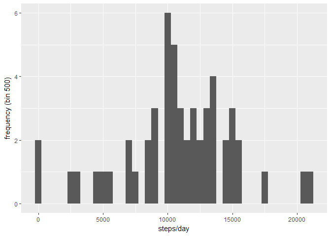
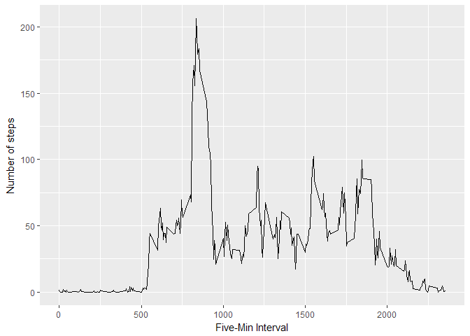
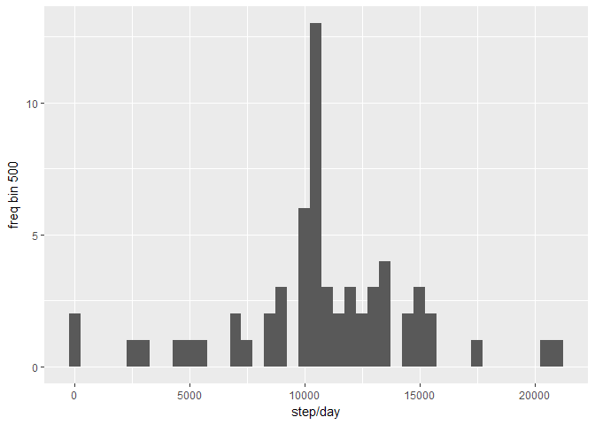
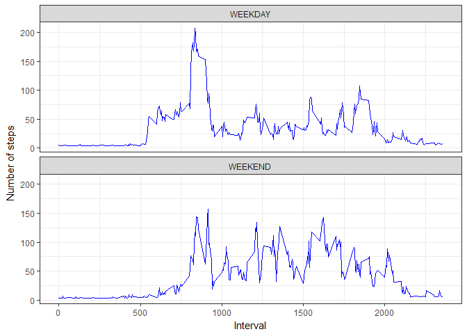

# Reproducible Research Course Project 1
C. K. Novy  
January 23, 2017  
# Reproducible Research: Peer Assessment 1 
##Just loading the data and removing NA values (for now)

```r
library(ggplot2)
library(mice)
```

```
## Loading required package: Rcpp
```

```
## mice 2.25 2015-11-09
```

```r
raw <- read.csv("./activity/activity.csv")
raw.noNA <- raw[complete.cases(raw), ]
```

##Next, looking at the mean total steps per day:


```r
daily.total <- tapply(raw.noNA$steps, raw.noNA$date, sum, na.rm = T)


steps <- qplot(daily.total, xlab = "steps/day", ylab= "frequency (bin 500)", binwidth = 500)
steps
```

```
## Warning: Removed 8 rows containing non-finite values (stat_bin).
```

<!-- -->

### Calculating the mean and median total number of steps:


```r
meansteps <- mean(daily.total, na.rm = T)
medsteps <- median(daily.total, na.rm = T)
```

 * Mean: 1.0766189\times 10^{4}
 * Median: 10765


## Ok, so what's the average daily activity pattern? 


```r
avg.step <- aggregate(steps ~ interval, data = raw.noNA, FUN = mean)

activityPattern <- ggplot(data = avg.step, aes(x 
                                               = interval, y = steps)) + 
  geom_line()+ 
  xlab("Five-Min Interval") + 
  ylab("Number of steps")
activityPattern
```

<!-- -->

### What's the five minute interal with the most steps? 


```r
most<- which.max(avg.step$steps)
mosttime <-  gsub("([0-9]{1,2})([0-9]{2})", "\\1:\\2", avg.step[most,'interval'])
```

It's 8:35 !

## So how many missing observations were there in the original data?


```r
 nacount <- sum(is.na(raw))
```

There are 2304 NAs. 

## Devising a sneaky strategy to impute NAs. 

```r
raw.fillNA <- mice(raw, meth = "norm.predict")
```

```
## 
##  iter imp variable
##   1   1  steps
##   1   2  steps
##   1   3  steps
##   1   4  steps
##   1   5  steps
##   2   1  steps
##   2   2  steps
##   2   3  steps
##   2   4  steps
##   2   5  steps
##   3   1  steps
##   3   2  steps
##   3   3  steps
##   3   4  steps
##   3   5  steps
##   4   1  steps
##   4   2  steps
##   4   3  steps
##   4   4  steps
##   4   5  steps
##   5   1  steps
##   5   2  steps
##   5   3  steps
##   5   4  steps
##   5   5  steps
```

```r
raw.fill <- complete(raw.fillNA)
checkNA <- sum(is.na(raw.fill))
```

Now there are 0 NAs. 

##A histogram of tital number of steps per day, with imputed data. 


```r
daily <- data.frame()


daily2.sum <- tapply(raw.fill$steps, raw.fill$date, sum, na.rm = T)

daily2.total <- data.frame(daily2.sum)

steps2 <- qplot(daily2.sum, xlab = "step/day", ylab = "freq bin 500" , binwidth = 500)
steps2
```

<!-- -->

### and the mean and mean of total number of steps per diem 


```r
 impmean <- mean(daily2.sum, na.rm=T)
 impmed <- median(daily2.sum, na.rm = T)
```
 
  * Mean: 1.0716969\times 10^{4}
  * Median: 1.0395\times 10^{4}
  
## Creating weekend/weekdays 

```r
raw.fill$date <- as.Date(raw.fill$date)
raw.fill$day <- weekdays(raw.fill$date, abbreviate = TRUE)

for(i in 1:nrow(raw.fill)){
  if(raw.fill$day[i] == "Sat" || raw.fill$day[i] == "Sun"){
    raw.fill$weekday[i] <- "WEEKEND" } else 
    {raw.fill$weekday[i] <- "WEEKDAY" }
}
```

### Panel plot! 


```r
avgWeek <- aggregate(steps ~ interval + weekday, raw.fill, mean)

weekendWarrior <- ggplot(avgWeek,aes(x=interval, y=(steps))) + 
  geom_line(color="blue") + 
  facet_wrap(~ weekday, nrow=2, ncol=1) +
  labs(x="Interval", y="Number of steps") +
  theme_bw()

weekendWarrior
```

<!-- -->


